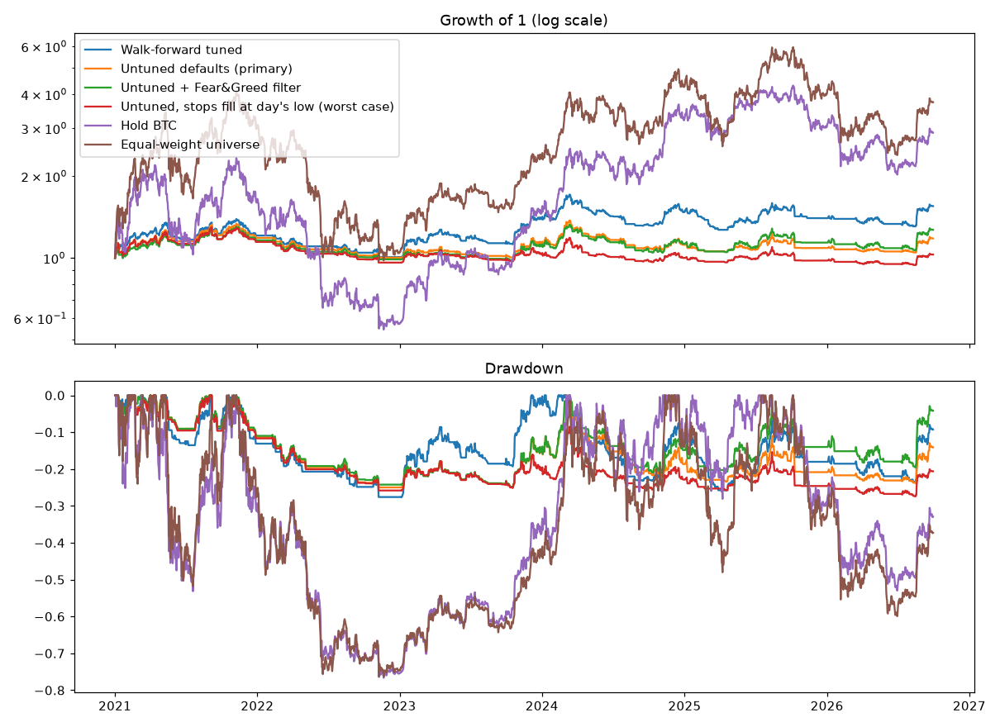

# BTC + ETH Pre-registered Experiment

## Run details

- Generated: 2026-10-05 23:32
- Command: run_phase1 --trials 60 --first-test-year 2021 --train-start 2019-01-01 --primary untuned --symbols BTCUSDT,ETHUSDT --max-single 0.5
- Data: 2 symbol files, 2017-08-17 to 2026-09-30
- Test period: 2021-01-01 to 2026-09-30

## Verdict

**NO-GO**: do not build the live bot on this strategy yet.

- ❌ Sharpe ≥ 1.0
- ❌ Sharpe 90% CI lower bound ≥ 0.5
- ✅ Max drawdown no worse than −35%
- ❌ PBO < 0.3
- ❌ Sharpe above Hold BTC
- ❌ Sharpe above Equal-weight universe

## Out-of-sample results

| | cagr | max_dd | sharpe |
|---|---|---|---|
| Walk-forward tuned | +7.9% | -27.7% | 0.54 |
| Untuned defaults (primary) | +2.9% | -25.0% | 0.28 |
| Untuned + Fear&Greed filter | +4.2% | -24.9% | 0.37 |
| Untuned, stops fill at day's low (worst case) | +0.5% | -27.4% | 0.10 |
| Hold BTC | +20.3% | -76.6% | 0.61 |
| Equal-weight universe | +25.8% | -76.3% | 0.68 |



## Yearly returns

| Year | Walk-forward tuned | Untuned defaults (primary) | Untuned + Fear&Greed filter | Untuned, stops fill at day's low (worst case) | Hold BTC | Equal-weight universe |
|---|---|---|---|---|---|---|
| 2021 | +21.0% | +18.6% | +16.2% | +14.6% | +59.8% | +199.4% |
| 2022 | -16.7% | -15.4% | -14.9% | -16.0% | -64.2% | -65.1% |
| 2023 | +37.9% | +12.6% | +11.7% | +7.3% | +155.6% | +122.7% |
| 2024 | +6.0% | -1.1% | +2.2% | -3.1% | +121.3% | +83.3% |
| 2025 | -4.9% | -2.7% | +1.0% | -2.3% | -6.3% | -6.2% |
| 2026 | +10.7% | +8.5% | +11.4% | +5.3% | -4.6% | -6.5% |

## Confidence (90%, stationary bootstrap) for the primary strategy

- CAGR: -6.4% to +13.1%
- Sharpe: -0.45 to 0.95
- Max drawdown: -45.4% to -15.8%

## Overfitting checks

- PBO (last fold, 60 trials): 0.40
- Deflated Sharpe probability (all 360 trials): 0.17
- Both understate the true search: the design and untuned settings were chosen after a probe on 2020–2026 data, and Optuna's trials cluster, which narrows their spread.

## Parameters chosen each year

- 2021: windows=(10, 53, 169), atr_mult=4.11, band=0.040
- 2022: windows=(12, 53, 91), atr_mult=3.44, band=0.011
- 2023: windows=(12, 54, 99), atr_mult=4.98, band=0.049
- 2024: windows=(12, 54, 133), atr_mult=3.41, band=0.045
- 2025: windows=(10, 66, 199), atr_mult=4.72, band=0.031
- 2026: windows=(12, 53, 90), atr_mult=4.66, band=0.021

## Trading activity

- Walk-forward: 906 trades, costs 2,292 USDT (each year restarts at 10,000)
- Untuned: 787 trades, 46 stops hit, costs 1,557 USDT on 10,000 start

## Caveats

- Each walk-forward year restarts with fresh capital and brake state.
- Not fully out-of-sample: the strategy design, the 20% volatility target, the brakes and the untuned defaults were chosen after a probe on 2020–2026 data; walk-forward only re-tunes 5 parameters. Expect live results to be worse.
- Equal-weight benchmark pays no costs.
- Data ends at the last complete month in the Binance archive.

## Base parameters

```
windows = (20, 50, 100)
vol_window = 30
cov_window = 60
vol_target = 0.2
max_gross = 1.0
max_single = 0.5
band = 0.02
atr_window = 14
atr_mult = 3.0
stop_cooldown_days = 5
stop_fill = 0.5
brake_half = -0.2
brake_pause = -0.3
brake_stop = -0.35
resume_level = -0.25
pause_max_days = 30
stop_resume_days = 30
universe_size = 10
min_history_days = 180
volume_window = 30
min_vol = 0.1
max_gap_days = 3
break_ratio = 20.0
fee_rate = 0.001
half_spread = 0.0005
impact_coef = 0.1
delist_haircut = 0.1
greed_threshold = None
greed_scale = 0.5
```
