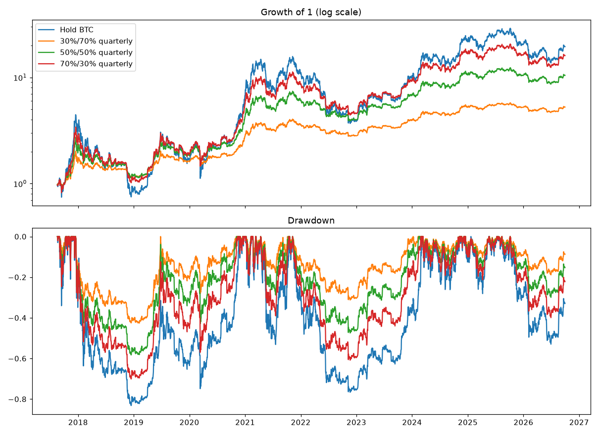

# BTC + Cash — Results

Pre-registration: `docs/specs/2026-10-06-btc-cash-preregistration.md` (rules fixed before this run).
Cash earns 0%. Costs 0.15% per traded dollar. Not financial advice.

## Verdicts (2017-08-17 → 2020-08-31, includes the 2018 crash)

- 30% BTC / 70% cash quarterly: **NO-GO**: CAGR below 2/3 of hold BTC; max drawdown worse than -40%
- 50% BTC / 50% cash quarterly: **NO-GO**: max drawdown worse than -40%
- 70% BTC / 30% cash quarterly: **NO-GO**: max drawdown worse than -40%

| | cagr | max_dd | sharpe |
|---|---|---|---|
| Hold BTC | +38.9% | -83.2% | 0.82 |
| 30% BTC / 70% cash quarterly | +23.7% | -42.6% | 0.87 |
| 30% BTC / 70% cash never rebalanced | +14.7% | -54.6% | 0.55 |
| 50% BTC / 50% cash quarterly | +33.5% | -58.3% | 0.87 |
| 50% BTC / 50% cash never rebalanced | +22.6% | -67.9% | 0.65 |
| 70% BTC / 30% cash quarterly | +39.0% | -70.1% | 0.85 |
| 70% BTC / 30% cash never rebalanced | +29.7% | -75.9% | 0.73 |

## Full period 2017-08-17 → 2026-09-30 (informational)

| | cagr | max_dd | sharpe |
|---|---|---|---|
| Hold BTC | +38.5% | -83.2% | 0.83 |
| 30%/70% quarterly | +19.9% | -42.6% | 0.92 |
| 50%/50% quarterly | +29.3% | -58.3% | 0.91 |
| 70%/30% quarterly | +35.6% | -70.1% | 0.88 |

### Yearly returns

| Year | Hold BTC | 30%/70% quarterly | 50%/50% quarterly | 70%/30% quarterly |
|---|---|---|---|---|
| 2017 | +220.1% | +65.1% | +108.9% | +153.1% |
| 2018 | -73.0% | -27.7% | -43.1% | -56.5% |
| 2019 | +94.3% | +35.9% | +56.1% | +73.4% |
| 2020 | +302.0% | +72.9% | +129.9% | +193.6% |
| 2021 | +59.8% | +27.4% | +41.9% | +52.7% |
| 2022 | -64.2% | -21.0% | -34.2% | -46.7% |
| 2023 | +155.6% | +39.6% | +69.4% | +101.9% |
| 2024 | +121.3% | +33.2% | +57.0% | +82.0% |
| 2025 | -6.3% | -0.2% | -1.2% | -2.8% |
| 2026 | -4.6% | +0.6% | -0.1% | -1.4% |

## Owner's $3,000 plan, sold at month 30 (weekly starts from 2017-09, heavily overlapping)

| | p10 | median | p90 | worst | lose | windows | independent |
|---|---|---|---|---|---|---|---|
| Hold BTC | +4% | +122% | +671% | -49% | 10% | 343 | 3 |
| 30% BTC / 70% cash quarterly | +14% | +52% | +148% | -7% | 3% | 343 | 3 |
| 50% BTC / 50% cash quarterly | +18% | +83% | +283% | -16% | 4% | 343 | 3 |
| 70% BTC / 30% cash quarterly | +18% | +103% | +437% | -28% | 5% | 343 | 3 |

