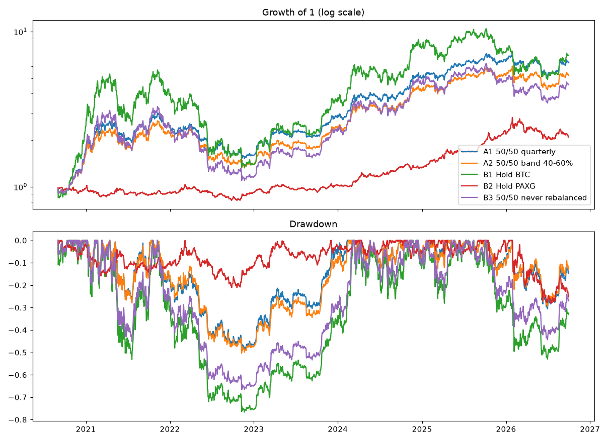

# BTC + Gold Core and Holding Rules — Results

Pre-registration: `docs/specs/2026-10-06-core-and-ml-preregistration.md` (rules fixed before this run).
Period 2020-09-01 → 2026-09-30. Costs 0.15% per traded dollar. Cash earns 0%.
**Not a clean out-of-sample test** (data seen before; gold rose about +110%). Not financial advice.

## Part 1 — Verdicts

- A1 50/50 quarterly: **NO-GO**: max drawdown worse than -40%
- A2 50/50 band 40-60%: **NO-GO**: max drawdown worse than -40%

## Full period (single deposit)

| | cagr | max_dd | sharpe |
|---|---|---|---|
| A1 50/50 quarterly | +35.4% | -49.5% | 1.11 |
| A2 50/50 band 40-60% | +31.3% | -50.3% | 1.02 |
| B1 Hold BTC | +37.7% | -76.6% | 0.85 |
| B2 Hold PAXG | +13.0% | -28.1% | 0.75 |
| B3 50/50 never rebalanced | +28.3% | -66.7% | 0.78 |

Reference, BTC+ETH trend bot (2021-01 → 2026-09, `reports/btc-eth-report.md`): +2.9%/yr, max DD −25%, Sharpe 0.28.

## Yearly returns

| Year | A1 50/50 quarterly | A2 50/50 band 40-60% | B1 Hold BTC | B2 Hold PAXG | B3 50/50 never rebalanced |
|---|---|---|---|---|---|
| 2020 | +73.3% | +60.9% | +142.6% | -2.4% | +70.1% |
| 2021 | +41.4% | +37.5% | +59.8% | -5.1% | +41.2% |
| 2022 | -34.8% | -36.8% | -64.2% | -0.7% | -52.0% |
| 2023 | +75.7% | +70.7% | +155.6% | +11.3% | +98.1% |
| 2024 | +78.3% | +73.9% | +121.3% | +29.8% | +100.8% |
| 2025 | +28.6% | +25.3% | -6.3% | +64.7% | +4.0% |
| 2026 | -1.8% | +0.8% | -4.6% | -4.0% | -4.4% |

## Owner's $3,000 plan — sell at a fixed month (same start dates for all horizons)

Weekly start dates heavily overlap; `independent` = non-overlapping windows.

| | p10 | median | p90 | worst | lose | windows | independent |
|---|---|---|---|---|---|---|---|
| A1 50/50 quarterly, 12m | -29% | +32% | +76% | -40% | 27% | 186 | 4 |
| A1 50/50 quarterly, 24m | -11% | +88% | +173% | -21% | 23% | 186 | 2 |
| A1 50/50 quarterly, 30m | +12% | +86% | +212% | -14% | 8% | 186 | 2 |
| A2 50/50 band 40-60%, 12m | -30% | +31% | +74% | -41% | 29% | 186 | 4 |
| A2 50/50 band 40-60%, 24m | -15% | +82% | +172% | -26% | 27% | 186 | 2 |
| A2 50/50 band 40-60%, 30m | +6% | +75% | +205% | -20% | 8% | 186 | 2 |
| B1 Hold BTC, 12m | -54% | +38% | +142% | -67% | 34% | 186 | 4 |
| B1 Hold BTC, 24m | -43% | +93% | +279% | -54% | 31% | 186 | 2 |
| B1 Hold BTC, 30m | -14% | +91% | +378% | -49% | 13% | 186 | 2 |
| B2 Hold PAXG, 12m | -5% | +8% | +30% | -11% | 30% | 186 | 4 |
| B2 Hold PAXG, 24m | -1% | +29% | +103% | -14% | 11% | 186 | 2 |
| B2 Hold PAXG, 30m | +5% | +48% | +128% | -5% | 2% | 186 | 2 |
| B3 50/50 never rebalanced, 12m | -28% | +28% | +78% | -37% | 32% | 186 | 4 |
| B3 50/50 never rebalanced, 24m | -19% | +79% | +175% | -28% | 30% | 186 | 2 |
| B3 50/50 never rebalanced, 30m | -6% | +69% | +221% | -22% | 12% | 186 | 2 |

## Part 2 — Holding rules (informational), on B3 50/50 never rebalanced and hold BTC

| | p10 | median | p90 | worst | lose | windows | independent |
|---|---|---|---|---|---|---|---|
| B3 50/50 never rebalanced: H1 sell at 30m | -6% | +69% | +221% | -22% | 12% | 186 | 2 |
| B3 50/50 never rebalanced: H2 staged exit, 24m | -21% | +86% | +168% | -30% | 32% | 186 | 2 |
| B3 50/50 never rebalanced: H2 staged exit, 30m | -8% | +70% | +214% | -22% | 13% | 186 | 2 |
| B3 50/50 never rebalanced: H3 half at +30%, rest 30m | +5% | +50% | +128% | -22% | 8% | 186 | 2 |
| B3 50/50 never rebalanced: H4 staged entry, 30m | -9% | +64% | +219% | -19% | 16% | 186 | 2 |
| B3 50/50 never rebalanced: H1 sell at 48m (2020+ starts) | +81% | +138% | +189% | +67% | 0% | 108 | 1 |
| B1 Hold BTC: H1 sell at 30m | -14% | +91% | +378% | -49% | 13% | 186 | 2 |
| B1 Hold BTC: H2 staged exit, 24m | -46% | +87% | +267% | -60% | 32% | 186 | 2 |
| B1 Hold BTC: H2 staged exit, 30m | -21% | +81% | +361% | -48% | 16% | 186 | 2 |
| B1 Hold BTC: H3 half at +30%, rest 30m | +2% | +57% | +211% | -49% | 10% | 186 | 2 |
| B1 Hold BTC: H4 staged entry, 30m | -23% | +70% | +366% | -41% | 21% | 186 | 2 |
| B1 Hold BTC: H1 sell at 48m (2020+ starts) | +86% | +156% | +312% | +62% | 0% | 108 | 1 |
| B1 Hold BTC: H1 sell at 48m (2017+ starts) | +113% | +276% | +526% | +62% | 0% | 265 | 2 |
| B1 Hold BTC: H1 sell at 30m (2017+ starts) | +4% | +122% | +671% | -49% | 10% | 343 | 3 |

48-month rows rest on very few independent windows and cannot support a conclusion on their own.
