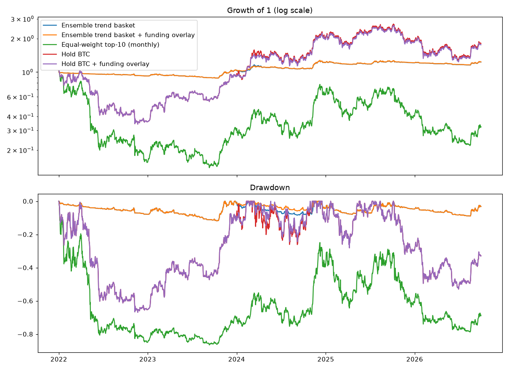

# Ensemble Trend Basket and Funding-Rate Overlay — Results

Pre-registration: `docs/specs/2026-10-06-ensemble-trend-funding-preregistration.md` (rules fixed before this run). Survivorship-free Binance spot universe; trades at next open. Not financial advice.

## Verdicts (hold-out 2022-01-01 → 2026-09-30, 0.20% per side)

- #1 Ensemble trend basket: **NO-GO**: CAGR below 2/3 of hold BTC
- #3 Funding overlay on hold BTC: **drop**
- #3 Funding overlay on the ensemble basket: **drop**
- Overlay ON 5% of hold-out days (13% of all days since 2018).

## Hold-out 2022-01 → 2026-09

| | cagr | max_dd | sharpe |
|---|---|---|---|
| Ensemble trend basket (0.20%) | +4.5% | -11.9% | 0.62 |
| Ensemble trend basket + funding overlay (0.20%) | +4.5% | -11.9% | 0.67 |
| Equal-weight top-10 (monthly) (0.20%) | -21.1% | -86.6% | 0.01 |
| Hold BTC (0.20%) | +13.3% | -66.9% | 0.50 |
| Hold BTC + funding overlay (0.20%) | +12.6% | -66.9% | 0.49 |
| Ensemble trend basket (0.10%) | +5.0% | -11.2% | 0.68 |
| Ensemble trend basket + funding overlay (0.10%) | +5.0% | -11.2% | 0.73 |
| Equal-weight top-10 (monthly) (0.10%) | -20.7% | -86.4% | 0.01 |
| Hold BTC (0.10%) | +13.3% | -66.9% | 0.50 |
| Hold BTC + funding overlay (0.10%) | +12.7% | -66.9% | 0.49 |
| Ensemble trend basket (0.30%) | +4.0% | -12.5% | 0.55 |
| Ensemble trend basket + funding overlay (0.30%) | +4.0% | -12.5% | 0.60 |
| Equal-weight top-10 (monthly) (0.30%) | -21.5% | -86.7% | -0.00 |
| Hold BTC (0.30%) | +13.3% | -66.9% | 0.50 |
| Hold BTC + funding overlay (0.30%) | +12.6% | -66.9% | 0.49 |

## Development 2018 → 2021

| | cagr | max_dd | sharpe |
|---|---|---|---|
| Ensemble trend basket (0.20%) | +12.1% | -7.1% | 1.45 |
| Ensemble trend basket + funding overlay (0.20%) | +9.5% | -7.1% | 1.60 |
| Equal-weight top-10 (monthly) (0.20%) | +67.9% | -71.7% | 1.07 |
| Hold BTC (0.20%) | +36.3% | -81.2% | 0.80 |
| Hold BTC + funding overlay (0.20%) | +43.5% | -81.2% | 0.87 |
| Ensemble trend basket (0.10%) | +12.4% | -6.9% | 1.48 |
| Ensemble trend basket + funding overlay (0.10%) | +9.7% | -6.9% | 1.64 |
| Equal-weight top-10 (monthly) (0.10%) | +68.6% | -71.6% | 1.08 |
| Hold BTC (0.10%) | +36.3% | -81.2% | 0.80 |
| Hold BTC + funding overlay (0.10%) | +43.7% | -81.2% | 0.87 |
| Ensemble trend basket (0.30%) | +11.8% | -7.2% | 1.42 |
| Ensemble trend basket + funding overlay (0.30%) | +9.3% | -7.2% | 1.56 |
| Equal-weight top-10 (monthly) (0.30%) | +67.3% | -71.8% | 1.07 |
| Hold BTC (0.30%) | +36.2% | -81.2% | 0.80 |
| Hold BTC + funding overlay (0.30%) | +43.3% | -81.2% | 0.87 |

Funding overlay, development 2020–2021 on hold BTC: with 2.01 Sharpe / -46.5% DD, without 1.59 / -53.6%.

### Yearly returns (hold-out, 0.20%)

| Year | Ensemble trend basket | Ensemble trend basket + funding overlay | Equal-weight top-10 (monthly) | Hold BTC | Hold BTC + funding overlay |
|---|---|---|---|---|---|
| 2022 | -7.8% | -7.8% | -84.5% | -64.2% | -64.2% |
| 2023 | +12.2% | +12.4% | +92.7% | +155.6% | +154.7% |
| 2024 | +17.5% | +17.7% | +109.9% | +121.3% | +115.8% |
| 2025 | -0.4% | -0.4% | -36.3% | -6.3% | -6.3% |
| 2026 | +1.7% | +1.7% | -19.2% | -4.6% | -4.6% |

## Notes found after the run (informational)

- The basket is mostly cash: average target exposure **8.7%** overall and **10.5%** in the hold-out (max 37%).
  With 1/10 slices, a 25% volatility target per coin and partial signals, little capital is ever at work.
  That is why its drawdown is tiny (−11.9%) and its return low (+4.5%/yr). The source paper allowed up to
  200% exposure (leverage), which is ruled out here.
- Raising exposure would be a new rule chosen after seeing results; it needs its own pre-registration and,
  since no unseen history is left, a forward (Testnet) test.
- Signals change on most days (some coin trades on ~360 days a year), so trading is frequent but small.
