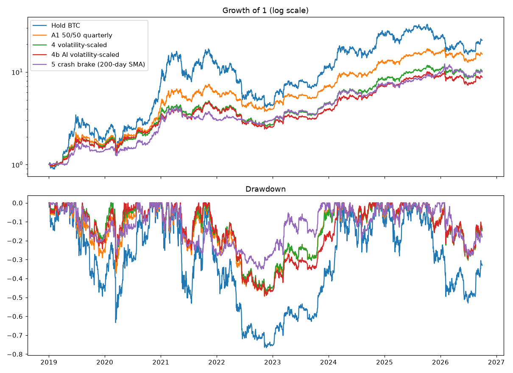

# Ideas 1–5 — Results

Pre-registration: `docs/specs/2026-10-06-ideas-preregistration.md` (rules fixed before this run).
Gold = COMEX futures (Yahoo GC=F) before 2020-09-01, PAXG after. Costs 0.15% per traded dollar. Not financial advice.

## Idea 1 — BTC + gold on unseen gold history (2017-08-17 → 2020-08-31)

- 30%/70% quarterly: **NO-GO**: max drawdown worse than -40%
- 40%/60% quarterly: **NO-GO**: max drawdown worse than -40%
- 50%/50% quarterly: **NO-GO**: max drawdown worse than -40%

| | cagr | max_dd | sharpe |
|---|---|---|---|
| Hold BTC | +38.9% | -83.2% | 0.82 |
| 30%/70% quarterly | +35.8% | -43.4% | 1.12 |
| 30%/70% never rebalanced | +23.3% | -55.5% | 0.74 |
| 40%/60% quarterly | +39.9% | -51.6% | 1.06 |
| 40%/60% never rebalanced | +25.8% | -63.0% | 0.73 |
| 50%/50% quarterly | +42.7% | -58.6% | 1.01 |
| 50%/50% never rebalanced | +28.2% | -68.5% | 0.74 |

Full period 2017-08-17 → 2026-09-30 (informational):

| | cagr | max_dd | sharpe |
|---|---|---|---|
| Hold BTC | +38.5% | -83.2% | 0.83 |
| 30%/70% quarterly | +31.2% | -43.4% | 1.15 |
| 40%/60% quarterly | +35.0% | -51.6% | 1.10 |
| 50%/50% quarterly | +37.9% | -58.6% | 1.05 |

## Ideas 4, 4b, 5 — Dynamic BTC share, rest in gold (2019-01-01 → 2026-09-30)

- 4 volatility-scaled: **NO-GO**: max drawdown worse than -40%; Sharpe not above A1 (50/50 quarterly)
- 4b AI volatility-scaled: **NO-GO**: max drawdown worse than -40%; CAGR below 2/3 of hold BTC; Sharpe not above A1 (50/50 quarterly)
- 5 crash brake (200-day SMA): **GO** (Testnet paper trading only)

| | cagr | max_dd | sharpe |
|---|---|---|---|
| Hold BTC | +49.0% | -76.6% | 0.96 |
| A1 50/50 quarterly | +42.6% | -49.5% | 1.21 |
| 4 volatility-scaled | +35.1% | -47.8% | 1.14 |
| 4b AI volatility-scaled | +32.4% | -49.2% | 1.07 |
| 5 crash brake (200-day SMA) | +34.7% | -35.1% | 1.21 |

Volatility forecast error (MAE, annualized vol): AI 0.220 vs naive 30-day 0.190. AI helps: **no**.
Average BTC weight: idea 4 46%, idea 4b 45%, idea 5 29%.

### Yearly returns

| Year | Hold BTC | A1 50/50 quarterly | 4 volatility-scaled | 4b AI volatility-scaled | 5 crash brake (200-day SMA) |
|---|---|---|---|---|---|
| 2019 | +89.5% | +67.1% | +60.2% | +55.9% | +42.7% |
| 2020 | +302.0% | +156.8% | +118.9% | +104.0% | +100.2% |
| 2021 | +59.8% | +41.4% | +17.2% | +26.8% | +5.6% |
| 2022 | -64.2% | -34.8% | -34.6% | -37.1% | +0.6% |
| 2023 | +155.6% | +75.7% | +69.5% | +54.0% | +47.7% |
| 2024 | +121.3% | +78.3% | +79.3% | +77.8% | +58.8% |
| 2025 | -6.3% | +28.6% | +28.2% | +28.3% | +34.6% |
| 2026 | -4.6% | -1.8% | -1.7% | -1.2% | +4.9% |

## Idea 3 — Monthly contributions, sold at month 30 (informational)

Gain is on total money deposited. Weekly starts from 2017-09, heavily overlapping.

| | p10 | median | p90 | worst | lose | windows | independent |
|---|---|---|---|---|---|---|---|
| Hold BTC, plan only ($3,000) | +4% | +122% | +671% | -49% | 10% | 343 | 3 |
| Hold BTC, plan + $100/month ($5,300) | +7% | +92% | +495% | -29% | 6% | 343 | 3 |
| 50/50 quarterly, plan only ($3,000) | +32% | +128% | +358% | -14% | 4% | 343 | 3 |
| 50/50 quarterly, plan + $100/month ($5,300) | +29% | +80% | +255% | -7% | 3% | 343 | 3 |

## Audit (2026-10-06, after the run; informational, does not change the verdicts)

Checks run after the results, so they cannot be used to pick a better rule. They test how fragile the
idea 5 GO is.

| Check | Result |
|---|---|
| Independent re-implementation of idea 5 (plain loop) | CAGR +35.0%, DD −35.1%, Sharpe 1.21. Matches; the small gap comes from the start: the engine buys the day-1 target (BTC was below its 200-day average on 2019-01-01, so 100% gold), the check started 50/50 |
| Trade one day later (decide at close, fill next close) | Sharpe 1.17, DD −36.0%: **would fail "Sharpe > A1" (1.21)** |
| Moving average 100 / 150 / 250 / 300 days | Sharpe 1.46 / 1.28 / 1.13 / 1.13; DD −33.7% / −32.7% / **−46.3%** / −38.6%: the drawdown pass depends on the length |
| Block bootstrap, Sharpe(idea 5) − Sharpe(A1) | 90% CI −0.32 to +0.33; idea 5 higher in 51% of resamples: **a tie** |
| Block bootstrap, max drawdown idea 5 vs A1 | Idea 5 shallower in 86% of resamples: the drop protection is the robust part |
| Brake into cash instead of gold | Sharpe 0.94 (below hold BTC 0.96): **gold carries much of the result** |
| Through the 2018 crash (2018-03-05 → 2020-08-31) | Idea 5 Sharpe 0.75, DD −27.7% vs A1 0.62, −41.5% vs BTC 0.39, −70.0% |

**Conclusion:** idea 5 passed the pre-registered rules, but only by a hair on Sharpe (1.2062 vs 1.2059).
What looks real is the smaller drawdown, including through 2018. Treat it as a candidate for Testnet
paper trading, not as a proven edge. The AI volatility forecast was worse than the simple 30-day
volatility (error 0.220 vs 0.190).

## Independent audits (Fable 5.1 and Opus, 2026-10-06)

Both auditors rebuilt the key results with their own code: every reported number matched, no
look-ahead was found, and the NO-GO verdicts for ideas 1, 4 and 4b are robust. Both judge the idea 5
GO to be **a statistical tie with A1** that flips under small, reasonable changes:

| Change (A1 recomputed under the same change) | Idea 5 Sharpe | A1 Sharpe | Verdict |
|---|---|---|---|
| As pre-registered | 1.2062 | 1.2059 | passes |
| Start 2018-12-31 / 2019-02-01 | 1.2060 / 1.1995 | 1.2104 / 1.2282 | fails / fails |
| End 2025-12-31 | 1.3119 | 1.3179 | fails |
| Costs 0.25% instead of 0.15% | 1.1926 | 1.2042 | fails |
| COMEX futures as gold for the whole period | 1.2124 | 1.2183 | fails |
| Rebalance on every quarter's first day, drift or not | 1.2052 | 1.2059 | fails |
| Weekly check on Tue / Wed / Thu / Fri / Sat / Sun | 1.193 / 1.279 / 1.180 / 1.092 / 1.086 / 1.165 | 1.206 | 1 of 6 passes; Thu–Sat also break −40% |
| 2023–2026 only | 1.367 | 1.468 | fails |

**Revised reading of idea 5: nominal GO, Sharpe tie with A1, about 8 points less growth a year than A1
(34.7% vs 42.6%). Its only real benefit is the smaller drawdown, and even that depends on the check
day and the moving-average length.** Correction to the audit table above: the "brake into cash" row
removed gold entirely (50% BTC + 50% cash, all cash when braking); keeping 50/50 BTC + gold and braking
into cash gives Sharpe 1.07, drawdown −27.9%.

Idea 3 wording: monthly contributions lowered the worst case in % terms, but the median gain also fell
(hold BTC 122% → 92%; 50/50 128% → 80%), the worst loss in dollars grew for hold BTC (−$1,467 → −$1,541),
and there are only 3 independent windows.

Bot fixes made after the audits: fees taken from the asset charged, full exits sold by quantity, order
lookup instead of re-sending after a timeout, readable error messages, fill and run logs, trade-day guard
(Monday close or quarter start), exchange clock sync, paths fixed to the repo root.
