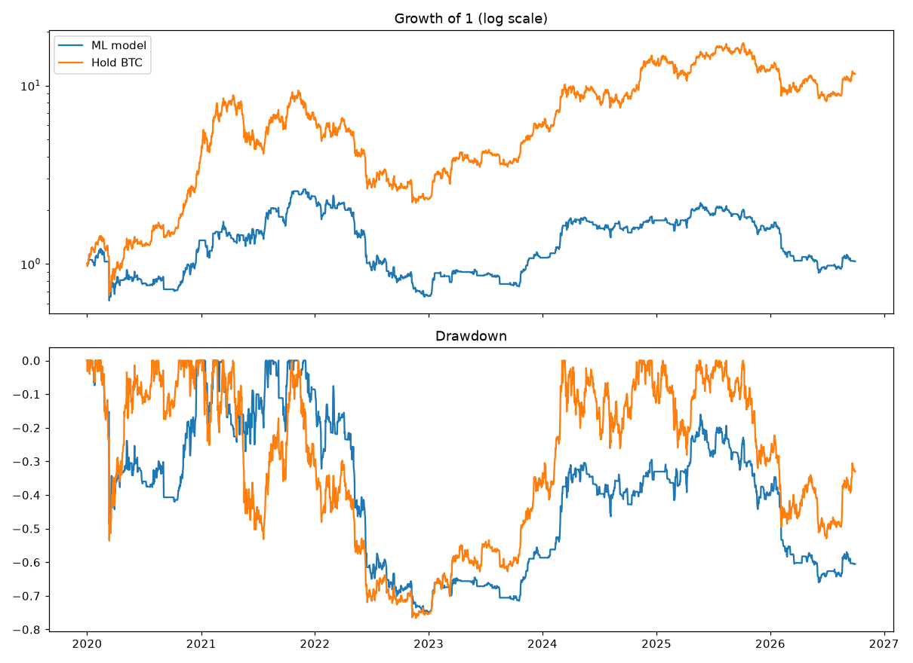

# CPU Machine-Learning Test on BTC — Results

Pre-registration: `docs/specs/2026-10-06-core-and-ml-preregistration.md` (rules fixed before this run).
Test 2020-01-01 → 2026-09-30, walk-forward yearly retraining, costs 0.15% per switch.
One fixed configuration, no tuning loop, so PBO is not computed.

## Verdict

**NO-GO**: Sharpe below 1.0; Sharpe CI lower bound below 0.5; max drawdown worse than -35%; Sharpe not above hold BTC

| | cagr | max_dd | sharpe |
|---|---|---|---|
| ML model | +0.5% | -75.1% | 0.25 |
| Hold BTC | +43.8% | -76.6% | 0.91 |

Sharpe 90% bootstrap CI: -0.39 to 0.88. Time in market: 53%. Switches: 596. Direction hit rate (P>0.5 vs actual 7-day move): 50.2%.

## Yearly returns

| Year | ML model | Hold BTC |
|---|---|---|
| 2020 | +35.4% | +302.0% |
| 2021 | +76.8% | +59.8% |
| 2022 | -72.5% | -64.2% |
| 2023 | +64.6% | +155.6% |
| 2024 | +62.0% | +121.3% |
| 2025 | -10.3% | -6.3% |
| 2026 | -34.3% | -4.6% |
