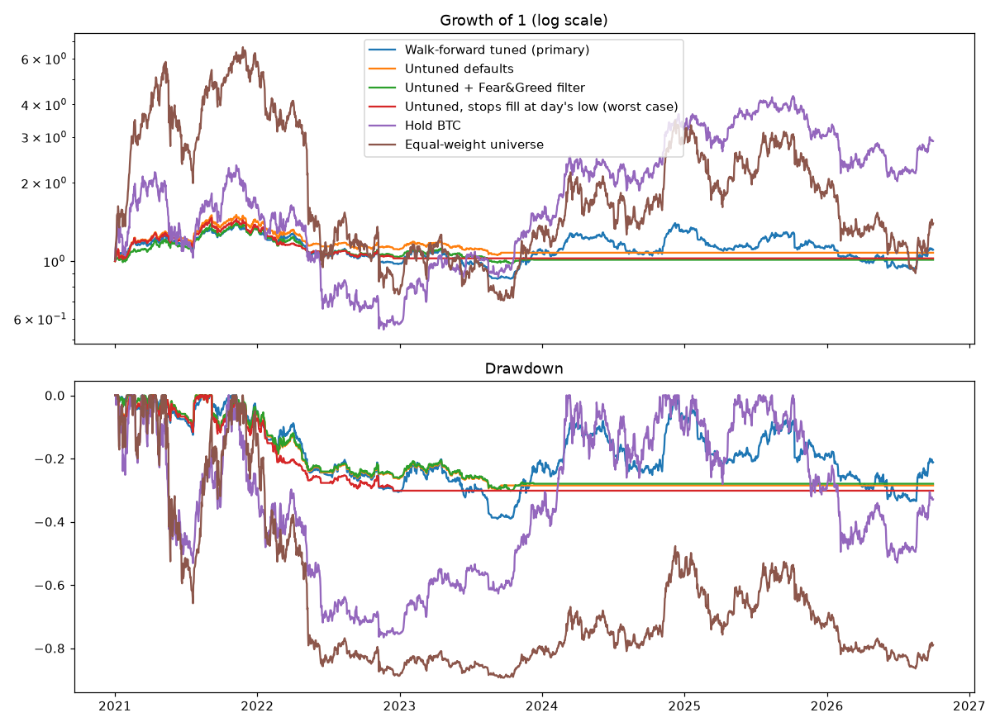

# Phase 1 Research Report

## Run details

- Generated: 2026-10-05 21:42
- Command: run_phase1 --trials 60 --first-test-year 2021 --train-start 2019-01-01
- Data: 756 symbol files, 2017-08-17 to 2026-09-30
- Test period: 2021-01-01 to 2026-09-30

## Verdict

**NO-GO**: do not build the live bot on this strategy yet.

- ❌ Sharpe ≥ 1.0
- ❌ Sharpe 90% CI lower bound ≥ 0.5
- ❌ Max drawdown no worse than −35%
- ✅ PBO < 0.3
- ❌ Sharpe above Hold BTC
- ❌ Sharpe above Equal-weight universe

## Out-of-sample results

| | cagr | max_dd | sharpe |
|---|---|---|---|
| Walk-forward tuned (primary) | +1.8% | -39.1% | 0.19 |
| Untuned defaults | +1.3% | -30.1% | 0.17 |
| Untuned + Fear&Greed filter | +0.2% | -30.2% | 0.07 |
| Untuned, stops fill at day's low (worst case) | +0.4% | -30.2% | 0.09 |
| Hold BTC | +20.3% | -76.6% | 0.61 |
| Equal-weight universe | +6.0% | -89.4% | 0.48 |



## Yearly returns

| Year | Walk-forward tuned (primary) | Untuned defaults | Untuned + Fear&Greed filter | Untuned, stops fill at day's low (worst case) | Hold BTC | Equal-weight universe |
|---|---|---|---|---|---|---|
| 2021 | +32.4% | +41.4% | +32.3% | +35.1% | +59.8% | +463.9% |
| 2022 | -26.1% | -21.6% | -21.6% | -24.1% | -64.2% | -86.7% |
| 2023 | +11.7% | -2.8% | -2.5% | +0.0% | +155.6% | +73.3% |
| 2024 | +19.0% | +0.0% | +0.0% | +0.0% | +121.3% | +119.4% |
| 2025 | -12.7% | +0.0% | +0.0% | +0.0% | -6.3% | -36.2% |
| 2026 | -2.7% | +0.0% | +0.0% | +0.0% | -4.6% | -23.2% |

## Confidence (90%, stationary bootstrap) for the primary strategy

- CAGR: -11.6% to +17.5%
- Sharpe: -0.59 to 0.98
- Max drawdown: -63.5% to -24.0%

## Overfitting checks

- PBO (last fold, 60 trials): 0.03
- Deflated Sharpe probability (all 360 trials): 0.01
- Both understate the true search: the design and untuned settings were chosen after a probe on 2020–2026 data, and Optuna's trials cluster, which narrows their spread.

## Parameters chosen each year

- 2021: windows=(24, 43, 162), atr_mult=4.67, band=0.034
- 2022: windows=(12, 41, 96), atr_mult=4.33, band=0.023
- 2023: windows=(30, 40, 191), atr_mult=4.32, band=0.035
- 2024: windows=(10, 70, 156), atr_mult=4.89, band=0.037
- 2025: windows=(11, 64, 194), atr_mult=4.62, band=0.045
- 2026: windows=(30, 52, 199), atr_mult=4.34, band=0.047

## Trading activity

- Walk-forward: 2095 trades, costs 2,367 USDT (each year restarts at 10,000)
- Untuned: 1060 trades, 93 stops hit, costs 796 USDT on 10,000 start

## Caveats

- Each walk-forward year restarts with fresh capital and brake state.
- Not fully out-of-sample: the strategy design, the 20% volatility target, the brakes and the untuned defaults were chosen after a probe on 2020–2026 data; walk-forward only re-tunes 5 parameters. Expect live results to be worse.
- Equal-weight benchmark pays no costs.
- Data ends at the last complete month in the Binance archive.

## Base parameters

```
windows = (20, 50, 100)
vol_window = 30
cov_window = 60
vol_target = 0.2
max_gross = 1.0
max_single = 0.3
band = 0.02
atr_window = 14
atr_mult = 3.0
stop_cooldown_days = 5
stop_fill = 0.5
brake_half = -0.2
brake_pause = -0.3
brake_stop = -0.35
resume_level = -0.25
stop_resume_days = 30
universe_size = 10
min_history_days = 180
volume_window = 30
min_vol = 0.1
max_gap_days = 3
break_ratio = 20.0
fee_rate = 0.001
half_spread = 0.0005
impact_coef = 0.1
delist_haircut = 0.1
greed_threshold = None
greed_scale = 0.5
```
